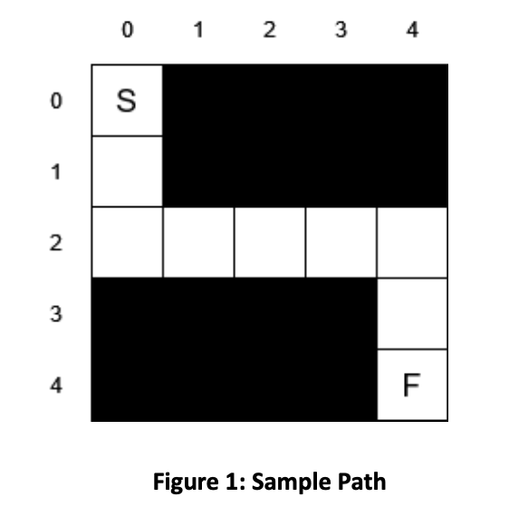
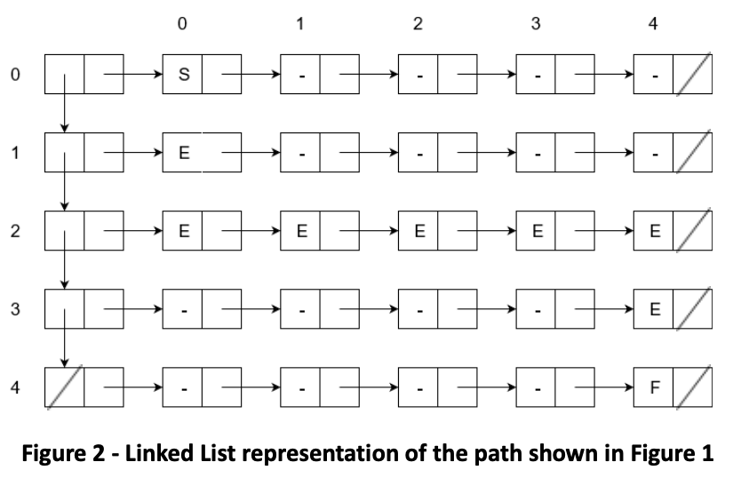

# Trivial Path finder written in Scheme

Tried to get a grasp on functional programming by doing this simple task.

It is a simple one way road and has only one solution: always one possible next square per a move.

The solution for the path shown in the picture below is "D D R R R R D D",

**Possible to make new paths by following the same rules as in 'sample-path'**

### Linked list representation of the sample-path

Initial linked list made after constructing the sample-path – reference for traversals 

## Environment setup for Scheme lang.

- Download and install the Racket application from the link: https://download.racket-lang.org/
- Open the DrRacket.app program and set the language to “The Racket Language” via
Language -> Choose Language

